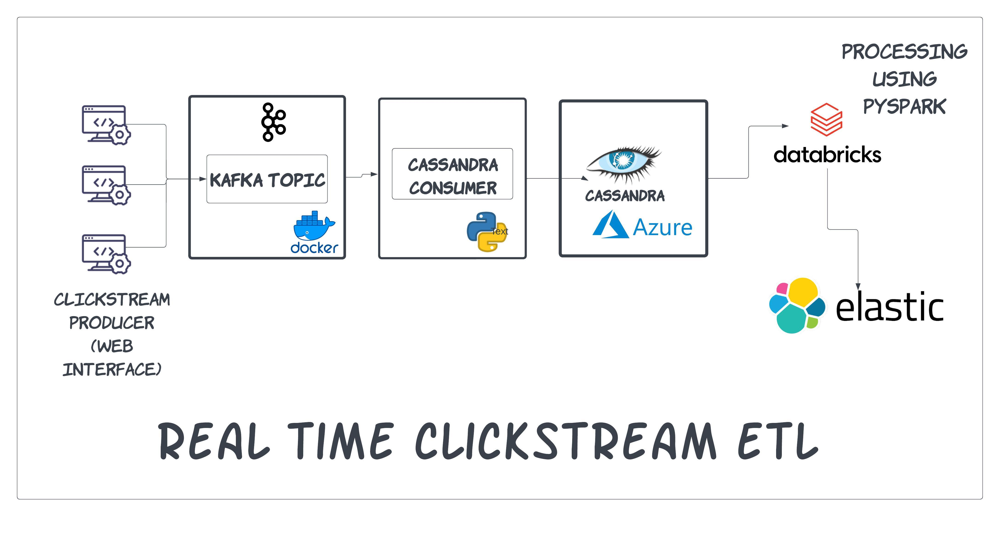

# Clickstream ETL Pipeline with Kafk,Cassandra and Databricks(Spark)




## Project Overview

This repository contains a Clickstream ETL (Extract, Transform, Load) pipeline designed to consume real-time data from a Kafka and Zookeeper cluster. The pipeline utilizes Python for initial data processing and enrichment before storing the raw clickstream data in Apache Cassandra. The raw data in Cassandra is then processed and enriched using PySpark on Databricks to perform complex transformations. Finally, the processed data is stored in Elasticsearch for efficient querying and analysis.

## Assumptions

The Clickstream ETL Pipeline assumes that the current clickstream data used for testing and demonstration purposes is generated from Python code using the Faker library. This Python code simulates user activity on web applications by generating synthetic clickstream events. The Faker library is used to create random user information, such as user IDs, timestamps, URLs, countries, cities, browsers, operating systems, and devices.


## Components

The Clickstream ETL Pipeline consists of the following components:
1. **clickstream_producer.py**: The Clickstream Producer is responsible for generating random clickstream events and publishing them to the Kafka topic. The producer mimics web application clickstream data and generates user information using the Faker library.

2. **casandra_consumer.py**: The Clickstream Consumer consumes the clickstream data from the Kafka topic and insert to Cassandra DB hosted on Azure.

3. **Data Schema**: The clickstream data is stored in Apache Cassandra. The schema for the `clickstream_events` table is defined as follows:


```
CREATE TABLE clickstream.clickstream_events (
  row_key TEXT PRIMARY KEY,
  user_id TEXT,
  timestamp TIMESTAMP,
  url TEXT,
  country TEXT,
  city TEXT,
  browser TEXT,
  os TEXT,
  device TEXT
);
```
4. **clickstream_spark_process.ipynb**: This Jupyter Notebook runs on PySpark and connects to the Cassandra database. It performs data transformations and aggregations on the clickstream data, calculating unique users per URL and country, and average time spent on each URL. The processed data is then inserted into Elasticsearch for efficient querying and analysis. This notebook can be scheduled to run at specified intervals for automated data processing and updating Elasticsearch with the latest insights


## Scaling

The Clickstream ETL Pipeline is designed to be scalable. It currently operates on a single Kafka instance but can be easily scaled horizontally to handle increasing data volumes. By adding more Kafka brokers and partitioning the topics, the pipeline can efficiently handle large amounts of real-time clickstream data.


